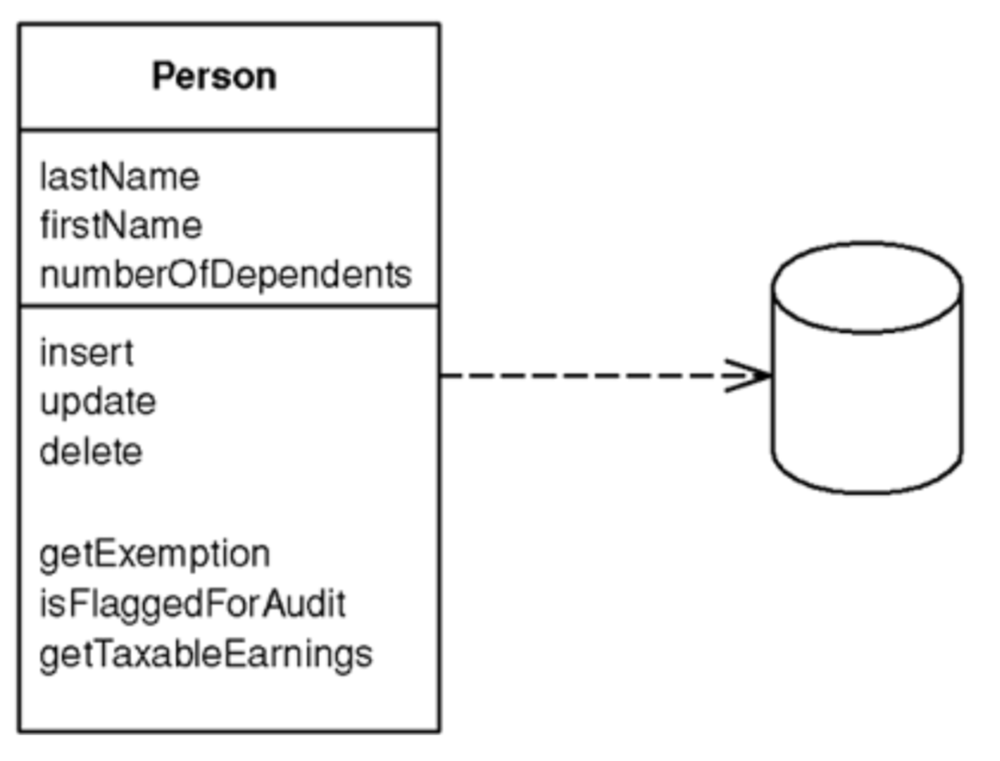
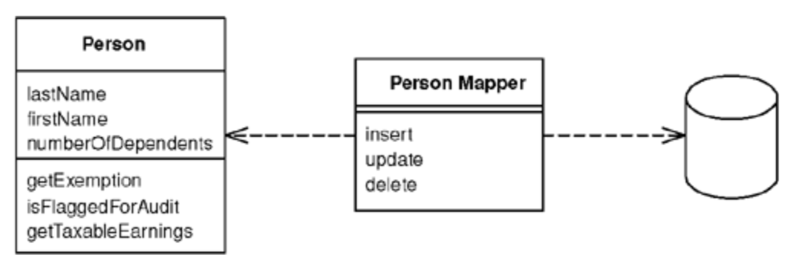
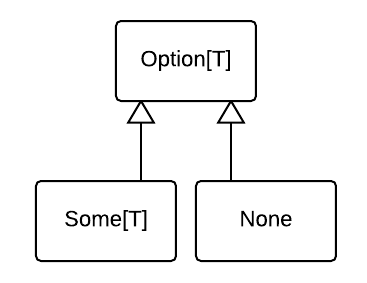

# 1 为什么全局或者静态对象是邪恶的？能够有代码的例子？

对于一个对象，其影响范围越小越好，也就是说其作用域越小越好。对于全局变量，对于所有的模块都有可见性；而静态成员，对于其所有的实例成员也都有可见性，这些将会增加软件的维护的复杂度。
```go
// tiger.go
package animal
var count = 0
func CreateTiger(){
    count++
}
// lion.go
package animal
func CreateLion(){
    count++
}
```
在这里`count`为包`animal`的全局变量，那么包类所有的成员都能访问该对象，一旦对`count`做出修改，就会影响包类全部使用该变量的成员。

# 2 介绍一下控制反转(IoC)，它是如何提高代码设计的？
  
# 3 迪米特法则（Low of Demeter）表述每个单元最外部了解的越少越好，编写违反这个原则的代码，说明它是不好的设计模式，并且修复它。

# 4 活动记录(Active-Record)是一种设计模式，它表述了代表数据库中表的对象应该拥有`Insert`,`Update`和`Delete`等相关操作。在你的观点和工作经验中，这中设计模式有什么限制和缺陷？

`Active Record`通常用在`MVC`或者`MVVM`模式中的`M`，也就是`Model`层，它将对象的业务层和持久化层封装在一起，每一个实例对应数据库表中的一行，每一个字段对应这个数据库表的中列。同时也包含数据库操作的`CRUD`操作。在一些不复杂的业务逻辑中，这种模式大大的提高了开发效率，在`Ruby on Rails`框架中广泛使用。但是这种设计模式违反了`Single Responsibility Principle`原则，将业务层和持久化层耦合在一起，如果更换数据库，所有的的`Model`都需要修改，而且还不利于编写单元测试。

# 5 数据映射(Data-Mapper)是另外一种设计模式，它鼓励使用`Mapper`层用来在内存对象和数据库之间移动数据，用来保证各自的独立。这个与活动记录`Active-Record`模式相反，你对这两种设计模式怎么看？在什么情况下使用其中一个，而不是另一个？

与`Active Record`模式不同，使用`Data Mapper`通过增加`Mapper`层，将业务层的数据对象和持久化层的数据进行解耦，使它们相互独立。对于包含复杂的业务逻辑和多个对象关联，使用`Data Mapper`能够有效减低系统的复杂度，但是`Mapper`层如何访问数据对象的需要考虑，通常使用反射机制，但是反射性能比较差。

# 6 为什么说引入`null`类型是一个`Billion dollar mistake`，你能说说有什么技术来避免它？比如在`GOF`书中提到的`Null Object Pattern`方法，`Option` 类型。
`null`可以理解两层含义：
- 无效的
- 空值
  
正因如此，在程序运行中中出现 `NulPointerException` 的异常，比如`Java`中实例对象调用方法的时候，如果实例为`null`，抛出NPE；在程序编写过程中，包含大量的 `obj != null` 的判断语句；而且在设计`API`过程中，如何正确地处理`null`类型也需要单独设计。

通常`NPE`出现的问题在于程序员在开发过程中，并没有区分两者的正确含义，对于空值，正确的做法应当是抛出异常；或者采用`go`语言中返回多个值，其中最后一个`error`接口表前面的返回值是否有效。在`GOF`中的`Null Object Pattern`模式，定义了`Option<T>`类型，包含了两个子类型：

```go
// interface
type Option interface {
    GetValue() interface{}
    IsNull() bool
}

// `Some` struct
type Some struct {
    val interface{}
}

func (s *Some) GetValue() interface{}{
    return s.val
}
func (s *Some) IsNull() bool {
    return false
}

// `None` struct
type None struct{

}
func (n *None) GetValue() interface{}{
    return nil
}
func (n *None) IsNull() bool {
    return true
}
```

# 7 许多观点是这样的：在面向对象编程(`OOP`)中，组合往往是比继承更好的选择，你观点是怎样的？

# 8 什么叫反腐化(`Anti-corruption`)层？
当一个应用程序从从原先的设计中向新的架构设计迁移，因为迁移的过程是逐步的，所以新的架构仍然需要调用原先接口。但是新的架构维持调用接口是非常费时费力，所以在调用中间增加一个反腐化层（`Anti-corruption Layer`)。同样问题也会出现在我们调用的外部模块的接口，该模块在设计上有质量的问题，通过反腐化层，来避免设计上的缺陷。
下图是反腐化层设计的示意图：

上图中应用程序包含了两个子系统，子系统A在调用子系统B的时候通过了反腐化层。子系统A和反腐化层的通信使用的子系统A的数据模型和架构，而反腐化层和子系统B的通信使用子系统B的数据模型和架构。在使用反腐化层设计的时候，需要考虑以下几点：
- 反腐化层可能增加两个子系统之间调用的延迟；
- 反腐化层增加的服务必须可以被管理和维护的；
- 考虑反腐化层如何扩展；
- 考虑是否可以增加多个反腐化层，因为可能将一个功能拆分成多个服务；
- 确保在反腐化层数据一致性保证可监控；
- 考虑反腐化层需要处理不同子系统的消息；
- 考虑反腐化层在架构迁移后是否退出整个应用程序；

那么反腐化层设计和设计模式的`Adapter`模式和`Facade`模式有什么区别呢？反腐化层用在哪些设计有缺陷的子系统或者模块中，而`Adapter`模式和`Facade`模式则不认为原先设计有什么问题，而是目前的需求无法满足，需要进行改造来完成特定需求。
